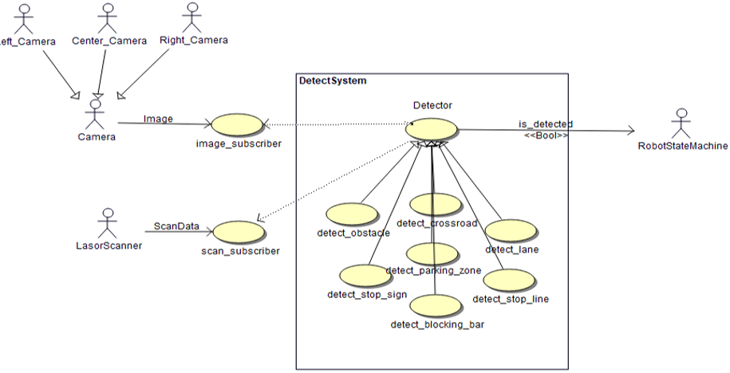
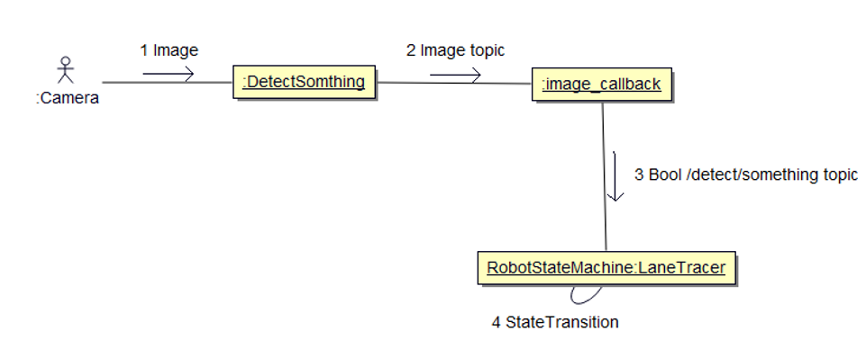
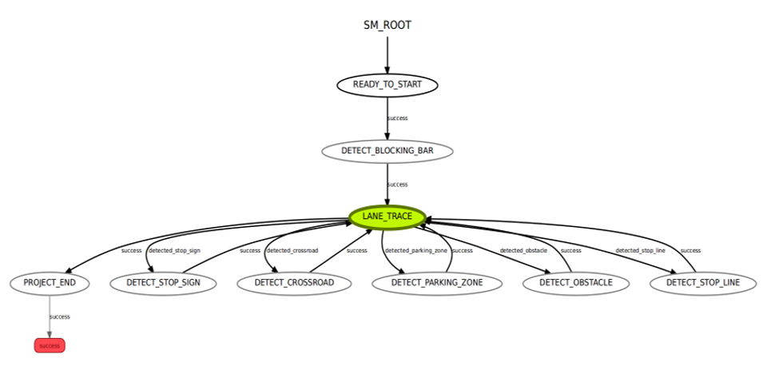
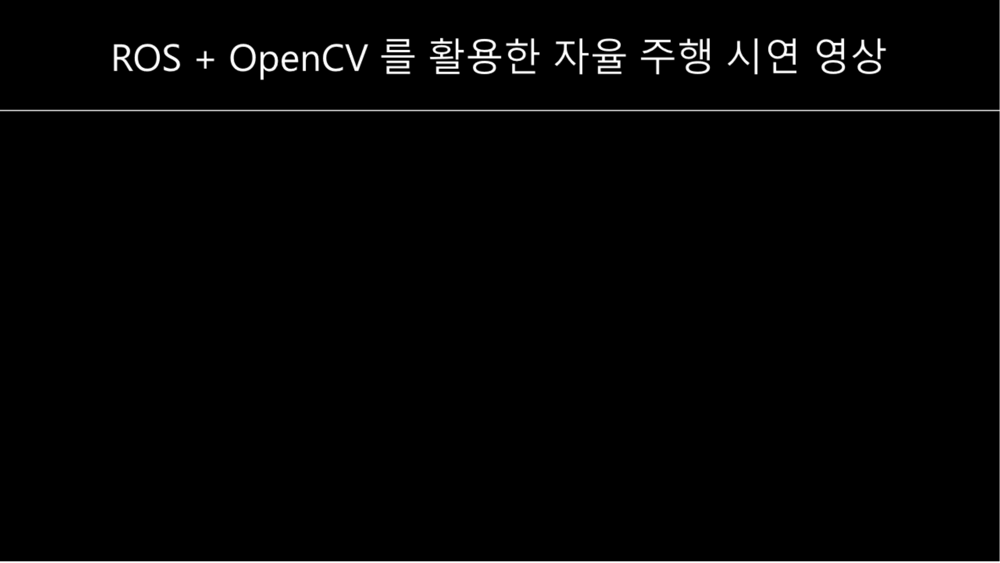
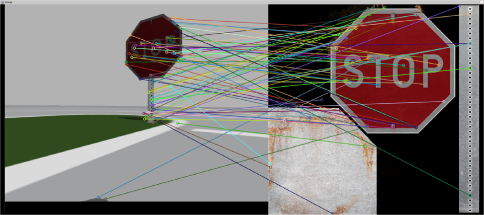

# Autonomous-Driving-Car
Object-Oriented Design Project

## 개요
- 주어진 시뮬레이션 환경에서 자율 주행 가능한 로봇을 구현

## 요구 사항
- 차선, 정지선, 정지 표지판, 차단바, 장애물을 인식하여 걸맞는 동작 수행
- T자, S자, 굴절 코스 극복 기능을 구현해야 함.

## 기능 목록
- 카메라를 이용한 영상 입출력 기능
- 입력된 영상을 처리 가능한 형태으로 변환
- 양 쪽 차선 인식을 통한 주행
- 사물 인식시 해당 사물에 대응하는 상태로 전이 후 동작 수행 (SMACH 사용)

## 비기능 사항
- 유지 보수와 오류 제어를 위하여 로봇 제어, 센서 데이터 처리, 로봇 상태 변환의 책임을 맡는 세 개의 클래스로 책임을 나누어 구현하였음.
- 테스트 범위를 한정하기 위하여 기능별 스크립트 실행 시 해당 기능만 수행되도록 구현하고, State Machine으로 기능을 통합하여 전체 시스템이 구동되도록 구현하였음. 

## 사용 기기 스펙
- Kinect Depth Camera
- Hokuyo Ridar Sensor

## UML
### Usecase

### Communication Diagram

### State Machine Diagram

## 시연 영상

### 정지 표지판 인식 (SURF)

